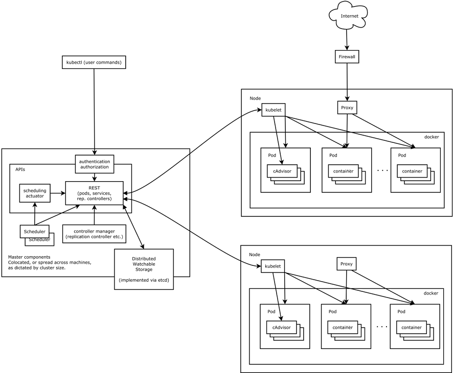

# k8s使用

#＃ k8s架构以及简介
    Kubernetes由两种节点组成：Master节点和Minion节点，前者是集群的管理节点，后者是容器运行的工作节点。



    APIServer：其中Master节点有一个重要的组件叫APIServer,负责响应用户的管理请求，进行指挥调度工作，任何对资源进行增删改查的操作都会交给APIServer处理后才提交给Etcd。

    Scheduler：作用是根据特定的调度算法(round robin)将Pod(后文会介绍)调度到指定的Minion上。这一过程在项目文档里也叫绑定。

    Controller Manager：运行在集群的Master节点上，是基于pod API上的一个独立服务，它重点实现了service Endpoint(服务端点)的动态更新，管理着Kubernetes集群中的各种控制器，包括下文会提到的replication controller和Node Controller。相比之下，APIServer负责接受用户的请求并创建出对应的资源，而Controller Manager则在系统中扮演的角色是在一旁默默地管控这些资源，确保它们永远保持在预期的状态。

    Kubelet：也是运行在Kubernetes集群的工作节点的重要组件，负责管理和维护在这台机上运行着的所有容器，说白了就是一个针对运行容器的Agent。

    Kube-proxy：即支持Http，也支持TCP和UDP连接，默认情况下提供Round Robin算法将客户端流量负载到Service对应的一组后端Pod的组件。在服务发现上，Kube-proxy使用etcd的watch机制监控集群Service和Endpoint对象的数据动态变化，并且维护一个从Service到Endpoint的映射关系，从而保证了后端pod的IP变化不会对访问者造成影响。

## k8s基础概念


### 1.Master
    Kubernetes里的Master指的是集群控制节点，每个Kubernetes集群里需要有一个Master节点来负责整个集群的管理和控制，基本上Kubernetes所有的控制命令都是发给它，它来负责具体的执行过程
    Master节点上运行着以下的一组进程

        <1>.Kubernetes API Server，提供了HTTP Rest接口的关键服务进程，是Kubernetes里所有资源的增删改查等操作的唯一入口，也是集群控制的入口进行。
        <2>.Kubernetes Controller Manager，Kubernetes里所有资源对象的自动化控制中心，也可以理解为资源对象的“大总管”。
        <3>.Kubernetes Scheduler，负责资源调度（Pod调度）的进程。
        
### 2.Node
    除了Master，Kubernetes集群中的其它机器被称为Node节点，是Kubernetes集群中的工作负载节点，每个Node都会被Master分配一些工作负载（Docker容器），当某个Node宕机时，其上的工作负载会被Master自动转移到其它节点上。
    每个Node节点上都运行着以下的一组关键进程：

        <1>.Kubelet：负责Pod对应的容器的创建，启动等任务，同时与Master节点密切协作。
        <2>.Kube-peoxy：实现Kubernetes Service的通信与负载均衡机制的重要组件。
        <3>.Docker Engine：负责本机的容器创建和管理工作。

### 3.Pod

    在Kubernetes中，能够被创建、调度和管理的最小部署单元是Pod，而非单个容器。Pod里的容器是共享网络和存储的。Pod是为了解决“如何合理使用容器支撑企业级复杂应用”这个问题而诞生的。一旦某个pod被分配到指定的工作节点上，那么这个pod就会在这个工作节点上一直运行到生命周期结束，中途不会被调度到其他节点上再次运行


### 4.Label

    <1>.Label是Kubernetes系统中的另外一个核心概念，一个Label是一个key=label的键值对，其中key与value由用户指定。Label可以附加到各种资源对象上，例如Node、Pod、Service、RC等，一个资源对象可以定义任意数量的Label，同一个Label也可以被添加到任意数量的资源对象上。
    <2>.Label通常在资源定义时确定，也可以在对象创建后动态添加或者删除。

    K8s使用Label的目的是：面向用户，使之成为用户级别的Kubernetes对象标识属性，因为label应该要包含对象的功能性和特战描述的特性。这样比UUID更加用户友好和更有意义。
    label selector是Kubernetes的核心的分组机制。目前，Kubernetes支持两类资源使用label selector来监控和管理它们的pod资源 --- services和replication controller (RC)

    
### 5.Replication Controller
    Replication Controller（简称 RC）是Kubernetes系统中的核心概念之一，决定了一个pod有多少个同时运行的副本。
    只要创建了一个pod，一般都推荐同时给pod创建一个replacation controller，让这个rc一直守护pod，直到pod删除。
    
    <1>.Pod期待的副本数（replicas）
    <2>.用于筛选目标Podde Label Selector。
    <3>.当Pod的副本数量小于预期数量的时候，用于创建新的Pod模板
    
    删除RC并不会影响通过该RC已经创建好的Pod。为了删除所有的Pod，可以设置replicas的值为0，然后更新该RC。另外，kubectl提供了stop和delete命令来一次性删除RC和RC控制的全部Pod。
    replica selector定义了RC和它所控制的pod之间的一种松耦合关系。这种松耦合关系可以通过修改pod的label将一个pod从replication controller的控制集中移除。比如可以把出现故障的pod从工作集群中移除，然后对pod进行debug。
    
### 6.Deployment
> Deployment的典型使用场景有以下几个：
- 创建一个Deployment对象生成对应的Replica Set并完成Pod副本的创建过程
- 检查Deployment的状态来看部署动作是否完成（Pod副本的数量是否达到预期的值）
- 更新Deployment以创建新的Pod（比如镜像升级）
- 如果当前Deployment不稳定，则回滚到一个早先的Deployment版本
- 挂起或者恢复一个Deployment

### 7.Service
> Service相当于我们微服务架构中的一个“微服务”

    Service这个概念存在的意义在于pod在Kubernetes中的IP地址不是固定的，因此需要一个代理来确保需要使用pod的应用不需要知晓pod的真实IP地址。另外一个原因是当使用rc创建了多个pod副本时，需要一个代理为这些pod做负载均衡。
    任何一个kube-proxy都能将流量正确导向任何一个被代理的pod，而这个kube-proxy不需要和被代理的pod在同一个宿主机上。 

### 8.其他
    如果不特别指明Namespace, 用户创建的pod、rc、service都讲被系统创建到这个默认的名为default的Namespace中

## yaml文件介绍

yaml定义文件说明：

    kind：表明此资源对象的类型，例如上面表示的是一个RC
    spec: 对RC的相关属性定义，比如说spec.selector是RC的Pod标签（Label）选择器，既监控和管理拥有这些表情的Pod实例，确保当前集群上始终有且 仅有replicas个Pod实例在运行。
    spec.template定义pod的模板，这些模板会在当集群中的pod数量小于replicas时，被作为依据去创建新的Pod


## k8s常用命令参考
    kubectl create -f mysql-rc.yaml
    kubectl get rc
    kubectl get pods
    kubectl create -f mysql-svc.yaml
    kubectl get svc
    kubectl get nodes
    kubectl get configmap
    kubectl get namespace

##　rc文件介绍
```yaml
apiVersion: v1
kind: ReplicationController
metadata:
  name: mysql
spec:
  replicas: 1
  selector:
    app: mysql
  template:
    metadata:
      labels:
        app: mysql
    spec:
      containers:
      - name: mysql
        image: dockerhub.io/library/mysql
        ports: 
        - containerPort: 3306
        env:
        - name: root
          value: "123456"
```
## SVC文件介绍

```yaml
    apiVersion: v1
    kind: Service
    metadata: 
      name: mysql
    spec:
    　ports:
    　　- port: 3306
    selector:
      app: mysql
```
    其中 metadata.name是Service的服务名，port定义服务的端口，spec.selector确定了哪些Pod的副本对应本地的服务